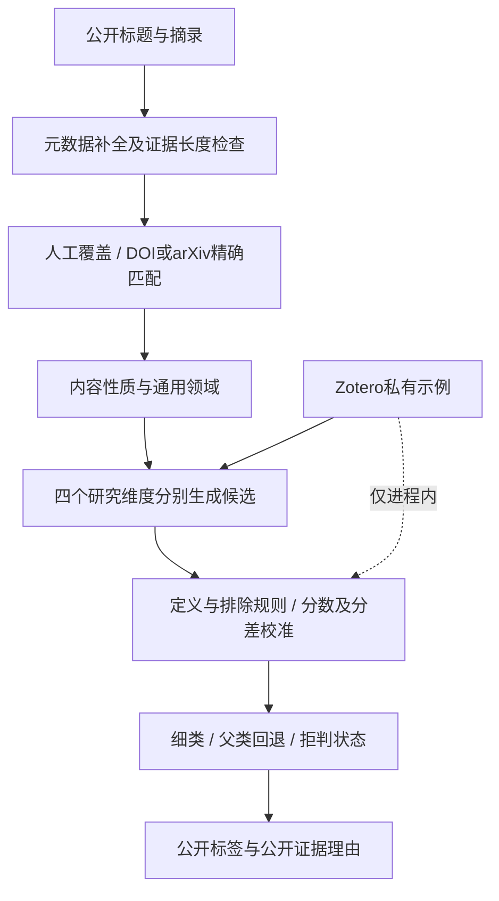

## Context

2026-10-09 用户最新 annotation 选择：直接采用新版分类作为默认版本，不设置 opt-in/selector；取消大批人工 gold 的上线前置门槛。质量状态为 unmeasured，不宣称90%或其他准确率。人工标注、dev校准及holdout准确率保留为后续独立量化工作，不假称完成；技术、隐私、真实浏览器、runtime、原生Pages与回滚/HTTP验收仍须通过。

见 proposal 的 Why 与 audit.md 的冻结证据。分类核心目前集中在 `site/site_topics.py`，收集阶段直接修改条目；界面是一份静态 app.js。用户要求同时改善准确性、目录结构与浏览体验。保留 GitHub Actions、site-data、Pages 以及本地私密配置工作方式。

## Goals / Non-Goals

**Goals:** 建立稳定的目录身份、跨维度多标签、可信的拒判与纠错、可读的主题浏览，以及可回滚默认v2发布；真实分类质量在后续独立量化，不由代码测试推定。

**Non-Goals:** 不自动整理/修改 Zotero；不新增账号系统、数据库或付费在线分类服务；不把分类语料传给 OpenRouter；不把修复 arXiv 排序长任务混入本变更；不承诺53个细类都已具备足够标注数据。

## Decisions

### 1. Zotero目录是研究视图，网站另有内容性质和通用领域

保留材料研究、AI方法、数据集与评测、科研软件与计算工作流四个维度，沿用其子目录。不在四个维度之间竞争同一个top-3。研究条目可同时标注“多孔框架材料 / 机器学习势函数 / 材料数据资源”。默认每个研究维度最多2个自动细类，四维自然上限为8个，不设置会挤掉其他维度的全局配额；材料对象允许并列，其余同维度的近邻类别需证据和分差。人工/可信精确匹配不强行截断，但去掉重复的祖先标签。

网站单独维护 `content_kind`（论文、技术报告、模型发布、工程更新、组织/政策动态）与 `domain_facets`（材料、化学、生命科学、通用AI等），命名空间 `web:` 与 `zotero:` 明确区分。新的网站领域标签不反写Zotero，组织动态仍保留在主时间线，避免为了排除研究错分而直接删掉新闻。

不采用“把所有新闻硬塞进当前53个目录”：原始目录主要服务材料与AI研究，不能完整表达模型/行业动态。

### 2. 稳定身份、公开投影与目录变更

新增本地0600私密配置 `ai4s-topics.private.yaml`，由同步工具通过stdin上传到 `ZOTERO_TOPIC_CONFIG` Secret。包含独立随机 `id_salt` 和私密collection发布范围；不写入公开 CUSTOM_CONFIG。公共ID为 HMAC(id_salt, collectionKey) 的定长安全编码，盐与API key轮换解耦，原始key不公开。公开 registry 保存 id、name、parent_id、facet、active/retired、alias、版本；重命名/移动仅改变展示，删除保留tombstone。

首次从路径hash迁移时，在同次Zotero快照内生成旧ID→稳定ID映射；无法唯一对应的节点进入迁移复核，不能按近似名称猜测。更新人工覆盖、条目标签、URL参数并保留旧ID别名。配置允许发布既有四个根目录，新增根目录默认不自动公开；00待确认继续排除。目录损坏、孤儿或循环应报告并保留最后有效快照。

选择HMAC而不是公开collectionKey或从名称生成ID，兼顾稳定身份与已有隐私边界。具体截断长度实施时固定为至少128bit并做碰撞检查。

### 3. 类别说明与示例构建

`site/topics/catalog.yaml` 为每个公开主题维护 facet、description、英文/中文synonyms、include/exclude规则、parent/leaf关系和定义版本。公开定义由维护者撰写，不复制私有文献摘录。目录新增后即有名称/父路径基础定义，标记 `definition_only`；没有参考样本也可以低置信度候选检索，不能悄悄变成不可预测类别。

例如自主科研系统需有假设、实验/计算执行、结果分析等科研行为的实质证据；银行部署AI、资助声明、泛泛agentic措辞不满足此定义。主动学习/贝叶斯优化需有主动选样、采集函数或同等明确机制。多孔框架纳入MOF/COF同义词，不由“crystal”一词决定所有材料类别。

私有库参考按稳定标识去重，再附多标签。使用标题/摘要，不取附件、笔记或完整PDF；每类取多样化示例，避免文献多的宽泛类别支配。首次实施输出不含私有文本的样本健康统计。

### 4. 分类流水线及拒判

匹配优先级：人工覆盖 > DOI/arXiv标准标识 > 无冲突标题匹配 > 自动候选。相同规范化标题但标识冲突时不直接继承。按父维度先筛选、子类再细化；同层不确定但父类明确时只给父标签，不能为了展示细类强行选一个。相似度不是概率。

基础词语路径保留作为可解释基线，同时试验本地多语言编码器 `intfloat/multilingual-e5-small`，模型revision与依赖锁定后进入runner基准。该模型官方说明384维、最长512token，并要求按任务加前缀；此处以对称分类表示统一使用 `query:`。长摘要按有界片段聚合，标题单独加权。默认起始上限2片段/文献、batch16、CPU线程与runner核数匹配；这些是待实测配置，不是已证明的速度承诺。[官方模型说明](https://huggingface.co/intfloat/multilingual-e5-small)

本次新版使用显式 provisional 配置和通过运行预算的后端，记录 calibration_status=pending_human_gold、quality=unmeasured；未测语义后端不启用。后续独立量化在开发集比较词语v2、语义候选和融合，测试集不调权重或阈值；未校准不等于已通过准确率门槛。语义不可用时可运行词语模式，但必须标明degraded，不能沿用语义模型的质量声明。

最终状态分两层：研究范围 `research / non_research / unknown`；分类状态 `classified / broad_only / low_confidence / insufficient_evidence / taxonomy_gap / pending / error`。模型发布可以有网站标签但没有研究细类；空摘要保留证据不足，公共元数据补全有来源白名单和超时预算。只有在真实新内容到来时，pending才表示尚未处理。

### 5. 可解释性、纠错与隐私

公开结果包含 label_id、facet、method、score（明确为相似度）、confidence_band、状态、基于公开输入的理由，以及版本收据。不得显示最近的私有参考标题、私有摘录、词表、向量、库内item key或collection key。UI理由可为“公开摘要出现MOF与gas adsorption，符合多孔框架定义”，不能为“与你收藏的某论文接近”。

普通访客纠错先存 localStorage，可导出包含公开item_id与topic_id的JSON。维护者用CLI校验后导入 `site/topics/overrides.json`，经普通Git提交成为全站覆盖。静态Pages不伪装成可直接写回服务端，也不在前端放GitHub token。覆盖记录保留理由、版本、创建时间和作者标识；目录删除或冲突时标为待复核，不能静默删掉用户修改。

私有语料/向量只在runner内存或临时0600文件使用，结束后清理，不进Actions artifact、公开branch、共享Actions cache或日志。仅模型权重和公开条目向量可跨次缓存。暂不建设加密私有向量缓存，先测实际耗时再另提变更。

### 6. 版本与增量更新

分类签名包含公共输入hash、身份/目录/定义版本、规范化与算法版本、模型revision、阈值配置hash、私有参考内容摘要hash、override版本。私有参考hash在内部缓存键使用，公开收据不包含其明文或内容；跨次比较采用身份盐HMAC后的不透明复合cache_token，而非暴露私有参考摘要hash。阈值、模型、词法和规则变化均触发指定范围重分类；提供dry-run diff、分批backfill和force开关。

公开文献的身份、first_seen、收藏ID、已读状态不随主题变化。迁移事务：生成候选archive→校验全部引用与计数→原子发布；失败保留有效上一版。只改显示名不重复生成所有语义向量，但分类收据更新到新目录版本。

### 7. 浏览设计

桌面四个主研究维度作为清晰分组，主题树支持搜索、展开/收起全部和选中路径自动展开。展开按钮与选择按钮分离；同时可显示当前范围数与全部归档数，格式固定“当前/全部”，父节点用item ID并集去重。计数包含日期、来源、搜索、未读、收藏等其他过滤条件，计算某维度节点时不先应用该维度已选主题，但继续应用其他维度已选主题，否则兄弟节点会无意义地变0或跨维计数失真；兄弟多选为OR，跨维度选择为AND，其他字段AND。

URL完整保存查询、日期/范围、来源、主题、排序与收藏视图；后退/前进恢复，旧ID重定向到新ID并提示迁移，不要求账号同步localStorage。条目标签点击后选中并展开路径，桌面侧栏滚动到该节点。没有结果时列出正在生效的筛选，提供逐项清除。

手机改为主题按钮+抽屉，展示已选标签与数量，支持焦点进入/关闭后返回、Esc、键盘方向键；宽度390px和桌面1440px做真实浏览器验收。现有minimal-DOM测试不能替代此证据。匹配不确定时显示具体状态和轻量纠错入口，避免全部叫待分类。

### 8. 默认新版发布与独立质量量化

依据2026-10-09用户最新annotation“直接采用新版”，通过技术门禁后默认页面直接使用v2，不新增opt-in或selector。新版结果显示“新版分类，准确率尚未量化”，收据记录quality=unmeasured与provisional阈值，不能将相似度、覆盖率或逻辑测试说成90%准确率。

上线仍须通过隐私、身份迁移、公开schema、强制逻辑回归、1440px/390px真实浏览器、所启用后端的真实runner性能，以及原生Pages部署、HTTP读回与维护者回滚演练。只允许已通过运行预算的后端；未测语义不启用。每日分类失败保留最后有效v2数据及最近成功时间，不以空数据覆盖归档。部署前保留可恢复v1版本及兼容前端；维护者回滚不重新生成付费摘要，不丢item ID、first_seen、收藏、已读和人工覆盖。

人工gold、支持数、开发集校准、留出精度和基线改进保留原工具及目标，但列为Deferred measurement，不阻塞本次默认v2发布。未经人工确认不能产生真实质量分数；不得把延期项勾为完成。直接采用新版是用户授权的产品选择，不是分类精度已达到原量化目标的证据。

## Risks / Trade-offs

- [目录重命名导致历史关联断裂] → 首发先完成稳定ID与alias迁移，旧收藏ID不动。
- [材料与生命科学样本分布不均、冷启动不可靠] → 新版明确unmeasured、按定义候选降置信度；后续按维度校准并报告支持数，不作已验证精度声明。
- [语义编码CPU耗时过长] → 有界片段/批次、模型权重缓存、10分钟冷启动分类预算；超预算不启用该后端，保留已验收词语模式。
- [严格拒判降低表面匹配率] → 用in-scope coverage与precision分别验收，组织动态不计研究漏分。
- [网站领域标签和Zotero含义混淆] → UI分别标记来源，研究目录不反写。
- [本地纠错不能自动全站生效] → 明示本机状态，导出→维护者CLI导入→Git提交；不增加未授权写服务。

## Migration Plan

1. 冻结v1公开输入并建立stable ID、alias及私有配置同步，离线验证重命名/移动/删除；人工gold独立延期，不作为默认v2上线依赖。
2. 增加v2记录与dual-read前端，先在独立构建中验证并保留v1可恢复版本，不新增访客opt-in selector。
3. 对公开archive影子分类，输出公开diff、拒判状态与runtime收据，质量明确unmeasured，不改first_seen和条目ID；不得输出私有参考或留出逐条错误。
4. 在真实runner完成所启用后端冷/暖更新，真实浏览器完成1440px/390px矩阵；演练新版每日更新失败保留最后有效数据。
5. 技术、隐私、浏览、runtime和回滚门禁通过后，原子发布默认v2并完成原生Pages部署；HTTP读回验证默认确为v2、归档与前端版本一致、未量化说明可见。
6. 维护者回滚恢复兼容v1或上一有效v2的manifest及静态资源，不重跑付费摘要，不丢收藏/已读/人工覆盖；检查HTTP读回。新版每日更新失败保留最后有效快照并显示stale/最近成功时间。
7. 人工标注、开发集校准、冻结holdout质量、基线比较作为后续独立量化工作；保持资料与工具、当前未完成状态及目标，不以新版上线代替这些结果。

## Open Questions

2026-10-09用户最新annotation已明确直接采用默认v2，取消opt-in rollout；大量人工gold不阻塞本次上线。后续语义融合权重、阈值校准和精度声明需依据独立量化与runner收据，公开gold支持不足须明示，不能据总体高分宣称全目录已验证。
